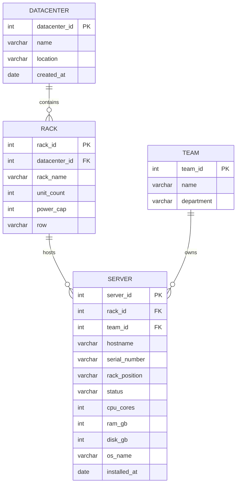

# hints
er-диаграммы делайте с общепринятыми правилами, вам то ладно но дальше ...  
стрелки в er, там треугольники, ромбы и тд (т.е наконечники у стрелок и какой тип связи обозначают) и еще какая линия тоже шарить  
реляционная модель что такое, data types, pk, fk, constrains (может спросить какие знаешь) - обозначить в таблице и объяснить в терминах реляционных бд (мб реляционной алгебры)  
функциональная зависимость что такое + биективность мб, хз что он там хотел  
нормальные формы бд (1,2,3,3extendex, ...)  
почему 4 форма(бойса кода - не должно быть не только зависимостей внутри таблицы(3нф) но еще и не должно быть зависвостей транзитивных) называется 3 расширенной  
super key?

# Тема: Сервера в дата центрах

# Задания:

- [x] Выделить основные абстракции (сущность, атрибут, связь) в предметной области и определить их параметры.
	- Определим сущности: датацентр (datacenter), стойка в датацентре (rack), сервер (server), команда (team)
	- Определим атрибуты сущностей:
		- datacenter - id, name, location, created_at
		- rack - id, datacenter_id, rack_name, unit_count, power_cap, row
			- будет иметь связь 1:N с datacenter
		- server - id, rack_id, team_id, rack_position, hostname, serial_number, status, cpu_cores, ram_gb, disk_gb, os_name, installed_at
			- будет иметь связь 1:N с rack
			- сейчас не будем делать дополнительную сущность хостовой ос и упростим этот факт, приняв что на 1 сервере может быть несколько ос и мы просто храним название
		- team - id, name, depart
			- будет иметь связь 1:N с server
- [x] Сформировать максимально полный перечень возможных запросов к базе данных на основе анализа предметной области.
	- Получить датацентры по
		- локации
	- Получить стойки по
		- датацентру
		- кол-во серверов
		- мощности
	- Получить сервера по
		- датацентру
		- стойке
		- команде
		- статусу (active, maintenence, deploying, retired)
		- кол-во хостовых ос
		- памяти
		- цпу
- [x] Построить концептуальную модель в виде ER-диаграммы.

- [x] Представить концептуальную модель в терминах реляционной модели.
	- Сущности и их описание:

	| Сущность | Описание |
	|---|---|
	| `DATACENTER` | Дата-центр, в котором размещаются стойки с оборудованием |
	| `RACK` | Стойка внутри дата-центра |
	| `SERVER` | Физический сервер, установленный в стойке |
	| `TEAM` | Команда-владелец сервера |

	- Полученная реляционная модель имеет следующий вид:

	| Отношение | Атрибуты |
	|---|---|
	| `DATACENTER` | `datacenter_id`, `name`, `location`, `created_at` |
	| `RACK` | `rack_id`, `datacenter_id`, `rack_name`, `unit_count`, `power_cap`, `row` |
	| `SERVER` | `server_id`, `rack_id`, `team_id`, `rack_position`, `hostname`, `serial_number`, `status`, `cpu_cores`, `ram_gb`, `disk_gb`, `os_name`, `installed_at` |
	| `TEAM` | `team_id`, `name`, `department` |
- [x] Описать домены (допустимые множества значений, которые могут принимать атрибуты), указывая типы соответствующих данных и их характеристики.

	### `DATACENTER`

	| Название поля | Тип | Ограничения |
	|---|---|---|
	| `datacenter_id` | `UUID` | `NOT NULL`, UNIQUE |
	| `name` | `TEXT` | `NOT NULL`, от 1 до 64 символов, UNIQUE |
	| `location` | `TEXT` | `NOT NULL`, от 1 до 128 символов |
	| `created_at` | `TIMESTAMP WITH TIME ZONE` | `NOT NULL`, не больше текущего времени |

	---

	### `RACK`

	| Название поля | Тип | Ограничения |
	|---|---|---|
	| `rack_id` | `UUID` | `NOT NULL`, UNIQUE |
	| `datacenter_id` | `UUID` | `NOT NULL` |
	| `rack_name` | `TEXT` | `NOT NULL`, от 1 до 32 символов, уникальное в рамках одного дата-центра |
	| `unit_count` | `INTEGER` | `NOT NULL`, `> 0` |
	| `power_cap` | `INTEGER` | `NOT NULL`, `> 0` |
	| `row` | `TEXT` | `NOT NULL`, от 1 до 16 символов |

	---

	### `SERVER`

	| Название поля | Тип | Ограничения |
	|---|---|---|
	| `server_id` | `UUID` | `NOT NULL`, UNIQUE |
	| `rack_id` | `UUID` | `NOT NULL` |
	| `team_id` | `UUID` | `NOT NULL` |
	| `rack_position` | `INTEGER` | `NOT NULL`, `> 0`, уникальное в рамках одной стойки |
	| `hostname` | `TEXT` | `NOT NULL`, от 1 до 64 символов, UNIQUE |
	| `serial_number` | `TEXT` | `NOT NULL`, от 1 до 64 символов, UNIQUE |
	| `status` | `TEXT` | `NOT NULL`, ENUM: `active`, `maintenance`, `deploying`, `retired` |
	| `cpu_cores` | `INTEGER` | `NOT NULL`, `> 0` |
	| `ram_gb` | `INTEGER` | `NOT NULL`, `> 0` |
	| `disk_gb` | `INTEGER` | `NOT NULL`, `> 0` |
	| `os_name` | `TEXT` | `NOT NULL`, от 1 до 64 символов |
	| `installed_at` | `TIMESTAMP WITH TIME ZONE` | `NOT NULL`, не больше текущего времени |

	---

	### `TEAM`

	| Название поля | Тип | Ограничения |
	|---|---|---|
	| `team_id` | `UUID` | `NOT NULL`, UNIQUE |
	| `name` | `TEXT` | `NOT NULL`, от 1 до 64 символов, UNIQUE |
	| `department` | `TEXT` | `NOT NULL`, от 1 до 64 символов |

- [x] Определить ключи и внешние ключи (если они есть).
	- datacenter
		- pk - id
	- rack
		- pk - id
		- fk (datacenter) - datacenter_id
	- server
		- pk - id
		- fk 1) rack - rack_id 2) team - team_id
	- team
		- pk - id
- [x] Выписать функциональные зависимости (рассматривая возможные значения полей таблицы)
	- (A -> B если внутри отношения R по каждое значение атрибута A связано только с одним атрибутом B, т е знаю А можем определить однозначно В а наоборот не можем)
	- datacenter
		- id -> name, location, created_at
		- name -> id, location, created_at
	- rack
		- id -> datacenter_id, rack_name, unit_count, power_cap, row
	- server
		- id -> rack_id, team_id, hostname, serial_number, rack_position, status, cpu_cores, ram_gb, disk_gb, os_name, installed_at
		- hostname -> id, rack_id, team_id, serial_number, rack_position, status, cpu_cores, ram_gb, disk_gb, os_name, installed_at
		- serial_number -> id, rack_id, team_id, hostname, rack_position, status, cpu_cores, ram_gb, disk_gb, os_name, installed_at
	- team
		- id -> name, department
		- name -> id, department
- [x] Привести полученную концептуальную модель к третьей нормальной форме (показать, что она находится в соответствующей нормальной форме).
	- 1 НФ выолняется
	- 2 НФ выполняется т.к уже 1НФ + каждый атрибут функционально зависит от первичного ключа
	- 3 НФ выполняется т.к уже 2НФ + нет транзитивных зависимостей (PK -> A -> B)