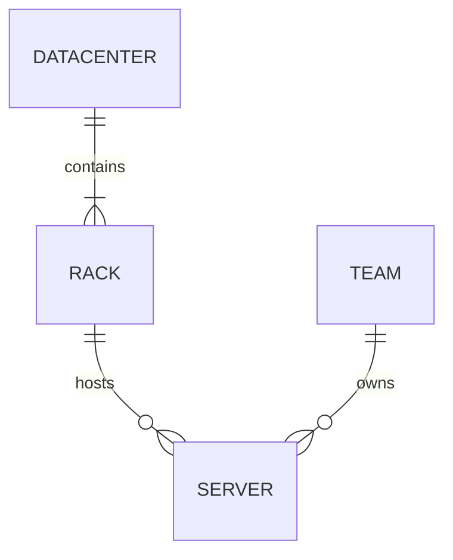
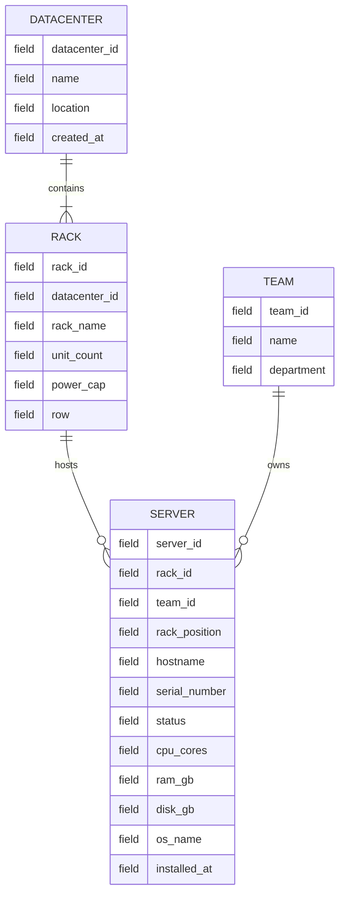
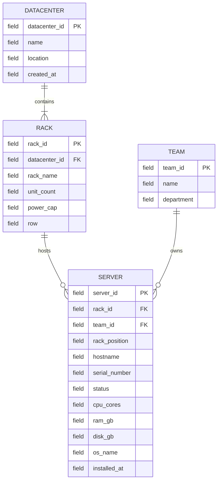
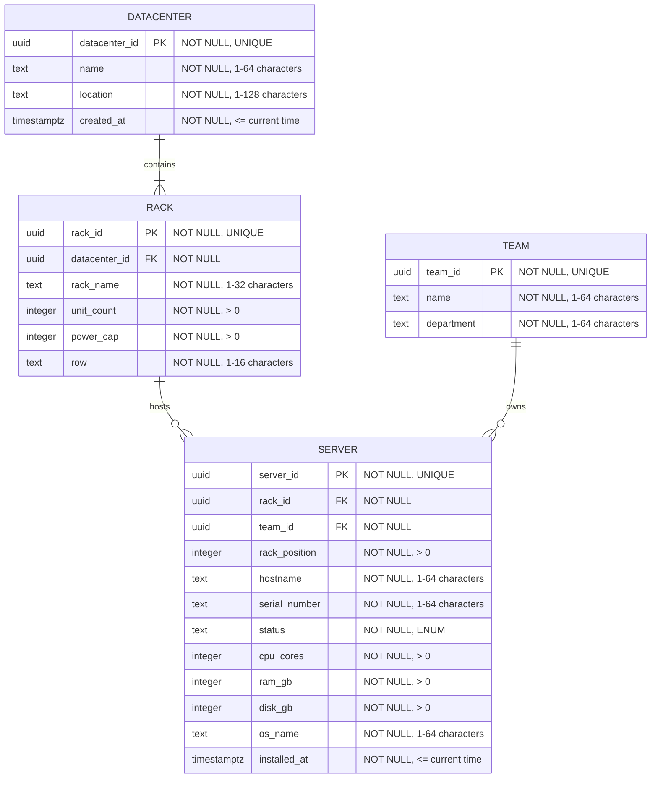

## схема базы данных для дата-центров

## 1. Инфологическая модель: сущности и связи

На первом уровне отображаются только основные сущности и отношения между ними.

## 2. Инфологическая модель: сущности, связи и названия полей

## 3. Даталогическая модель: поля и ключи

## 4. Даталогическая модель: типы данных и ограничения

