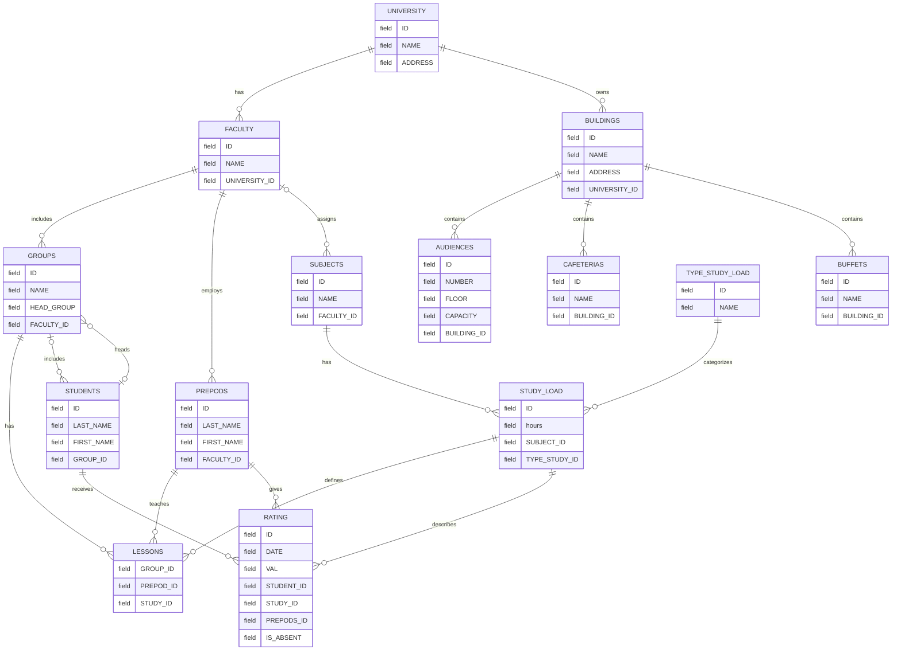

# Информационная система университета

## Инфологическая модель: сущности, связи и названия полей

| Сущность | Описание |
|---|---|
| `UNIVERSITY` | Высшее учебное заведение |
| `BUILDINGS` | Здания университета |
| `AUDIENCES` | Аудитории в зданиях университета |
| `CAFETERIAS` | Столовые в зданиях университета |
| `BUFFETS` | Буфеты в зданиях университета |
| `FACULTY` | Справочник факультетов |
| `GROUPS` | Справочник учебных групп |
| `STUDENTS` | Справочник студентов |
| `PREPODS` | Справочник преподавателей |
| `SUBJECTS` | Справочник учебных дисциплин |
| `TYPE_STUDY_LOAD` | Справочник типов учебной нагрузки |
| `STUDY_LOAD` | Учебная нагрузка по дисциплине и типу занятий |
| `LESSONS` | Занятия, связывающие группу, преподавателя и учебную нагрузку |
| `RATING` | Оценки студентов |

